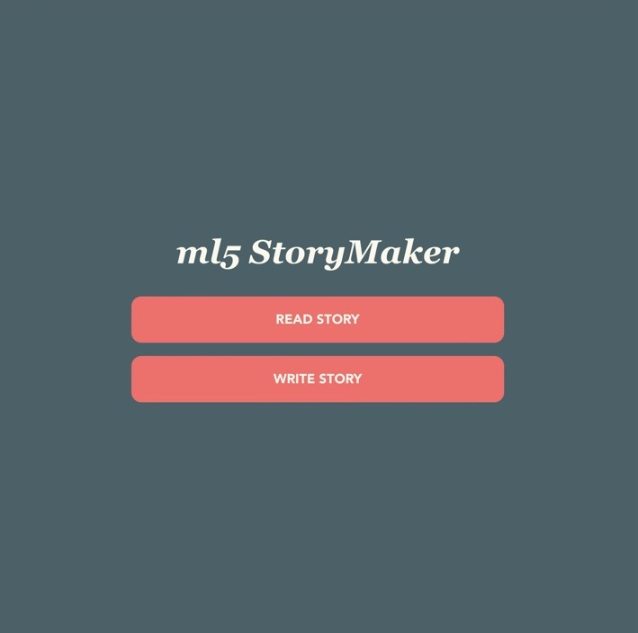
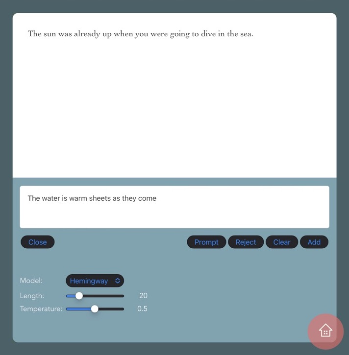

react-ml5-storymaker
=======

This React project is bootstrapped using [Vite](https://vitejs.dev/guide/).

# Goal

This project is part of my study of [ml5.js](https://learn.ml5js.org), the friendly machine learning library **for the web**!

After finishing [Image Classifier](https://https://github.com/supershaneski/react-ml5-sample), I was deliberating by myself if either I should put all `ml5` exercises into one or separate projects.

I decided it would be better to make separate projects to explore the different features of `ml5`. 

So this one is for [CharRNN](https://learn.ml5js.org/#/reference/charrnn).





I will be making some sort of a Story Maker based on the contents generated from `ml5`'s `charnn.generate()` method.

To start writing story, go to `Write Story` from `Home` page.





In `Edit` page, first, press `Start Paragraph` to start a paragraph. 

You can type something into the textarea or leave it blank before pressing `Prompt` button.


# Getting Started

Clone the repository, install the dependencies and run

```sh
$ git clone https://github.com/supershaneski/react-ml5-storymaker.git myproject

$ cd myproject

$ npm install

$ npm start
```

Your browser will open to `http://localhost:3000/` or some other port depending on the availability.


# Installing **ml5.js**

The latest version as of this writing is 0.12.2.

To install `ml5.js` in your own project

```sh
$ npm install ml5@0.12.2
```